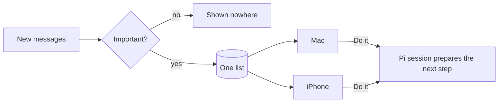

<div align="center">

# Pix

**Pix gives Pi wings for everyday coding.**

Practical tools and thoughtful defaults, in one Pi package.

</div>

## Install

Requires [Pi](https://github.com/earendil-works/pi-mono) and Node.js 22+.

```bash
pi install npm:@brooktang/pi-x
```

Restart Pi. Your usual Pi workflow stays the same.

<details>
<summary>Install from GitHub or ask your agent</summary>

```bash
pi install git:github.com/MisterBrookT/pi-x
```

Or paste this into your coding agent:

```text
Help me install Pix from https://github.com/MisterBrookT/pi-x. Verify that Pi and Node.js 22+ are available, install Pix using the documented Pi command, and do not change unrelated Pi configuration.
```

</details>

## About

Pix is a focused package for people who like Pi's simplicity but don't want to assemble their everyday setup from scratch. It brings web research, bounded delegation, background work, and a more comfortable editor together—without replacing Pi or turning it into a broad automation framework.

Pix is under active development. macOS and Linux are supported; Windows is not yet verified. Language servers and computer use require separate setup.

## What you get

- **Practical tools.** Web search and source retrieval, parallel subagents, and optional language-server diagnostics and fixes.
- **Web access Pix owns.** Search runs through your Pi OpenAI or Codex login, pages and PDFs are extracted to markdown, and large results are stored for retrieval by slice or passage. Requests are guarded against private-network access on every redirect.
- **Less babysitting.** Visible todos, structured questions, background jobs with completion and configurable health-check wakes, and opt-in goal mode for unfinished work.
- **A more comfortable editor.** Inline history suggestions, optional AI completion, list continuation, and compact pasted text and images.
- **Control over the setup.** One tool panel, context inspection, and a configurable footer. Computer use and MCP start on demand.
- **Proactive, not just responsive.** A background watcher reads your channels (Feishu today, more via plug-ins), decides what matters, and puts it in one list shown on both the Mac and your phone. One tap starts a Pi session that prepares the next step; nothing is sent without you. [How it works](docs/proactive.md)



- **Mermaid that renders.** Diagrams use the current `lovely-mermaid`, so HTML entities and `<br/>` in edge labels work instead of falling back to source. A wide flowchart is re-laid out top-down; a simple wide sequence diagram uses narrower participant boxes and wraps labels and messages instead of dumping source. Pi's `markdown.mermaid` setting still applies.

## Start here

Use Pi normally—Pix's enabled tools are available to the agent as needed. A few controls worth knowing:

| Command | Use it to |
| --- | --- |
| `/tool` | Choose which tools are enabled |
| `/goal Fix the failing tests` | Keep working toward an explicit goal, within a continuation limit |
| `/complete on` | Enable cloud-model inline completion; off by default |
| `/rc` | Continue this live session from your phone ([setup](docs/guide.md#remote-control)) |
| `/context` | See what is filling the context window |
| `/context html` | Open prompt, tool schemas, and messages as one HTML page (`Alt+H`) |

See the [full guide](docs/guide.md) for all commands, configuration, and limits.

**Only want some of it?** Every feature is its own Pi extension. Run `pi config` and turn off the ones you don't need, or list only the ones you want in `~/.pi/agent/settings.json`:

```json
{ "packages": [{ "source": "npm:@brooktang/pi-x", "extensions": ["extensions/remote.ts", "extensions/question.ts"] }] }
```

<details>
<summary>Using a Claude subscription</summary>

Sign in with Claude Code, then select a model under `pix-anthropic`. Pix reads Claude Code credentials on each request and never refreshes or saves them. If an older `pix-anthropic` OAuth entry remains in `~/.pi/agent/auth.json`, back up the file and remove only that entry once; otherwise it takes precedence over Claude Code auth. Set `PIX_ANTHROPIC_API_KEY` to use API credits instead.

**This is an unofficial compatibility transport.** Anthropic may change or reject it, and using it may risk account restriction. Pi's native `anthropic` provider remains unchanged and uses Anthropic's third-party extra-usage billing. Use that provider if the subscription-transport risk is unacceptable.

[Provider details](docs/guide.md#what-it-adds)

</details>

## Documentation

- [User guide](docs/guide.md) — tools, editor, commands, and configuration
- [Goal mode](docs/goal-mode.md) — continuation behavior and safety limits
- [Proactive](docs/proactive.md) — receive, judge, one list on Mac and iPhone, act
- [Design philosophy](docs/guide.md#philosophy) — what belongs in Pix, and what doesn't
- [Development](docs/guide.md#development) · [Roadmap](ROADMAP.md) · [Report an issue](https://github.com/MisterBrookT/pi-x/issues)

## Thanks

Built on [Pi](https://github.com/earendil-works/pi-mono) and its extension community, especially LazyPi, pi-web-access, pi-subagents, and pi-lsp. See [third-party notices](THIRD_PARTY_NOTICES.md).

[MIT](LICENSE). See [third-party notices](THIRD_PARTY_NOTICES.md) for credits and licenses.
