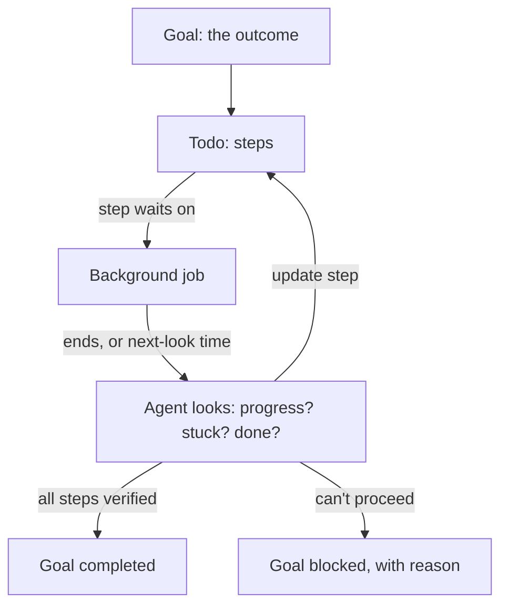

# Goal, todo and background

Three tools, one loop. Each answers one question:

| Piece | Question | Owns |
|---|---|---|
| Goal | What outcome am I working toward? | continuing, completion, blockers |
| Todo | Which steps, and which is next? | the plan |
| Background | What is running while I wait? | long commands and their wake-ups |



## Rules

1. **Every goal wait has a next look.** While a goal is active, `background start` refuses `reminder: "off"`. The agent picks the interval from what it knows: the job's ETA, or soon and backing off when unknown. Long waits are allowed when chosen, never by accident.
2. **Steps can name the job they wait on.** A todo item may carry `job: "<id>"`. When that job ends, the todo reminder says `Job <id> <state>: update #<step>`, so the plan never claims "running" after the work stopped. Status is still written only by the agent.
3. **Stale plans resurface.** An open plan unchanged for 20 tool calls is re-shown with the call count.
4. **The agent manages the goal.** It starts, resumes, replaces, completes or blocks it, with evidence. Automatic pauses (errors, session restore) can be resumed by the agent.

## Status line

Minimal, one line each:

```
goal on · 2/10
1 job running · look 14:20 · /jobs
```

`look` shows the earliest next check of a goal job.

## Why

A session stalled for 8.5 hours: a watcher waited only for success, with health checks off and a 10-hour timeout. The awaited server never came up, so nothing woke the agent. Rule 1 removes that failure mode while letting the agent choose how often to look.
