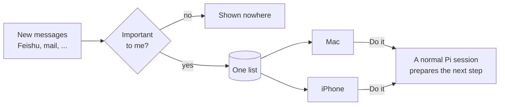
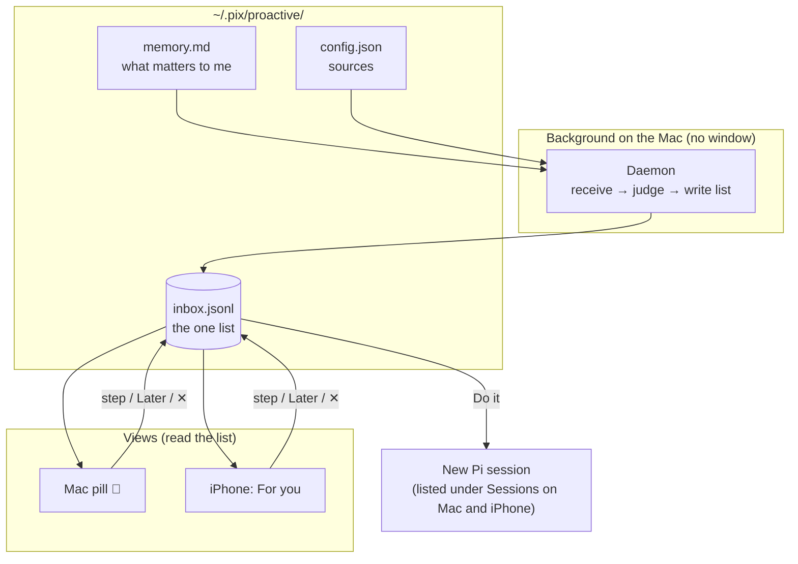
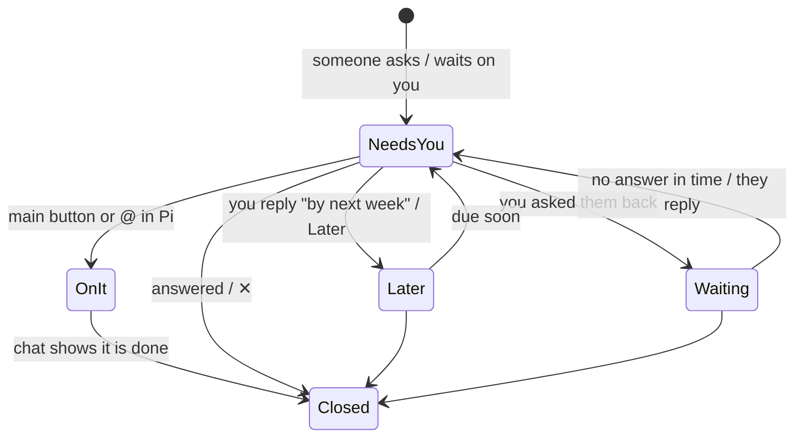
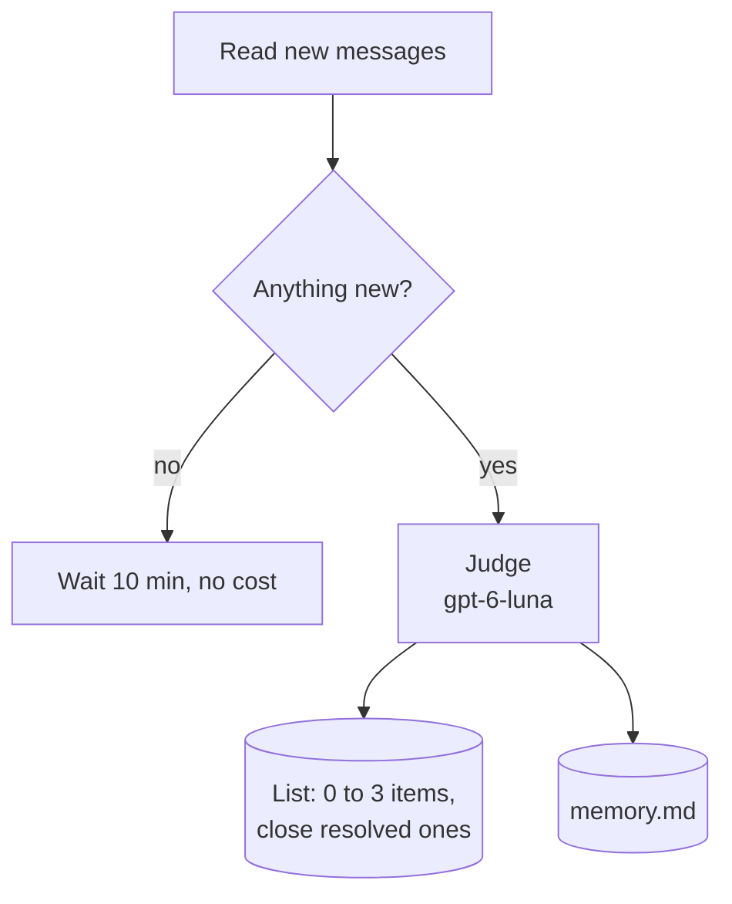
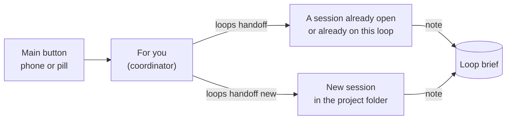
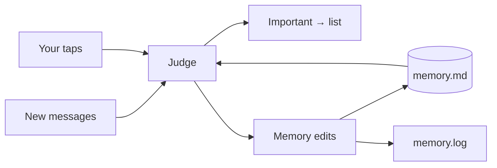
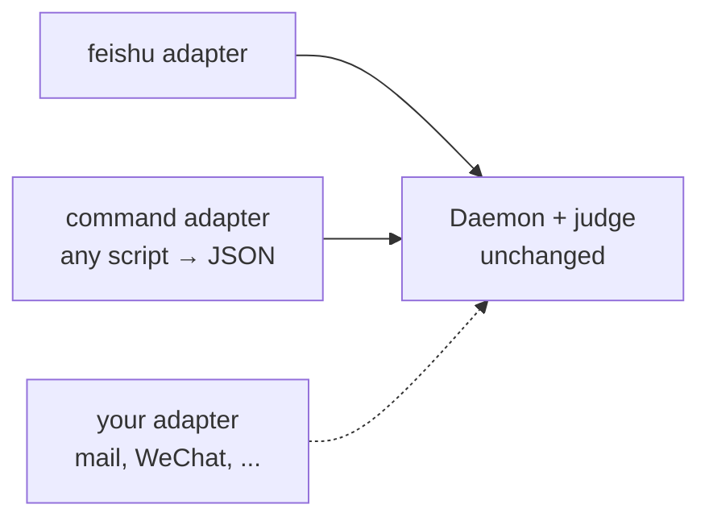

# Proactive

Most assistants wait for you to ask. Pix Proactive watches your channels, keeps track of your **open loops** (things still unfinished between you and someone else), and shows you only what needs you now, with the next step ready.

## The idea in one picture



Three rules keep it calm:

1. **The agent keeps the books, not you.** When a chat moves on (you reply, someone delivers), the loop changes with it. You never sort items into states.
2. **One list, shown everywhere.** The Mac pill, the iPhone, and `@` in Pi read the same loops. Handle one anywhere, it changes everywhere.
3. **Nothing is sent without you.** The main button starts a Pi session that prepares the work. Anything outbound is drafted for your approval first.

## What runs where

No terminal becomes a "proactive terminal". Everything runs in the background or in normal sessions.



| Piece | File | Job |
|---|---|---|
| Core | `src/proactive.ts` | Types, judge prompt, verdict, list format, rate limit |
| Sources | `src/proactive-sources.ts` | One adapter per channel |
| Daemon | `scripts/proactive-daemon.ts` | Poll sources, judge, write the list; `act`, `later`, `dismiss`, `note` verbs |
| Coordinator | `extensions/foryou.ts` | In the For you session only: the map of open loops and the `loops` tool |
| Mac view | `scripts/proactive-pill.swift` | Floating 🔔 with the needs-you count; click to see those, plus quiet lines for loops Pi is on or that come back later |
| List + Do it | `src/proactive-store.ts` | The only code that reads or changes the list; "Do it" starts a Pi session with remote on |
| iPhone view | Pix Remote "For you" page (opened from the menu, or by tapping the push) | Same list, same buttons, a push for each new item |

## One loop

Every loop answers three questions and offers three buttons:

| Field | Example |
|---|---|
| What happened | 王梓萱 asked you to try Databento |
| Why it matters | It may fill the real-time data gap |
| Where | 王梓萱 (Feishu) |
| **Main button** | Named by the judge for the step Pi will prepare ("Draft reply", "Start test"); "Do it" if unnamed |
| **Later** | Hide it until the day before it is due (or tomorrow morning) |
| **✕** | Drop it for good |

A loop moves on its own; you only see the "needs you" part:



| Status | Shown as | Comes back |
|---|---|---|
| `pending` | **Needs you** (pill count, push) | n/a |
| `onit` | **Pi is on it** (phone) | when its due time comes |
| `later` | **Later: you owe it** (phone) | morning before `due`, else 7 days |
| `waiting` | **Later: waiting on them** (phone) | morning before `due`, else 3 days |
| `done` `resolved` `dismissed` | Today: handled | never |

"On it" is not "done": a loop closes when the chat shows it is finished, or when you tap ✕.

## The daemon

A launchd service with no window. Every 10 minutes, for each source:



One model, one call per batch of new messages (`model` in config, default `openai-codex/gpt-6-luna`). It is a tool-less `pi -p` call, so any provider Pi is logged into works. It sees every open loop from every source and returns:

- `alerts`: truly new loops (rare; "no follow-up" alerts are dropped)
- `update`: an existing loop moved (new state `needs`/`later`/`waiting`, title, next step, button, `due`). A task card or mail about the same thing updates the loop instead of adding a duplicate.
- `close`: loops that are finished
- `memory`: edits to lasting facts

Your own messages count too, marked `(me)`: when you reply in a chat that has an open loop, the judge runs and moves or closes it. "OK, I'll test it by next week" turns "reply to her" into "Test Databento, due 10-16", parked until the day before. Your messages alone, with nothing open there, cost no call. Images reach the judge only as `[image]`, so a reply sent only as a picture may not close an item.

Over `maxPerHour`, new items still enter the list, marked quiet: no push, never dropped.

## Moving a loop on

A loop's main button is always the next real step, and it changes as the work moves:

| Who | How | Example |
|---|---|---|
| Work session | `proactive-daemon.ts next <id> "<button>" "<step>" ["<done>"]` when its step is finished | Test done -> **Send results to Amber**, back in "needs you" |
| Coordinator | `loops` tool, action `next` | same |
| Judge | an `update` with the next `button`/`action` when the chat shows progress | "测完了，晚点发你" -> **Send results** |

Buttons on a card: main button, Later, **✓ Done** (brook handled it himself; the judge reads it as "acted on"), ✕ (not worth tracking).
Quiet rows (Pi is on it, later) show, on hover in the pill or always on the phone: **✓ Done**, and **Open** (focus or resume the session on it) or **Now** (bring it back to "needs you").

## The coordinator

Every main-button tap goes to **one** Pi session, `For you` (session id `pix-foryou`, model `gpt-6.1-sol`). It is the coordinator: it decides where each loop is best done, then hands it off in seconds. It never does loop work itself, so taps never queue behind each other and many loops run in parallel, one session each. There are no routing rules.



Each turn it gets a map, rebuilt from files, so its own chat can stay short:

| Context | From |
|---|---|
| Memory (projects, folders, people) | `memory.md` |
| Every open loop: state, due, project, session on it, brief | `inbox.jsonl` |
| Pi sessions open now, with folders | the Remote hub |

And one tool, `loops`, only in that session:

| Action | Does |
|---|---|
| `handoff` | Send a loop to a session id (live: queued there; closed: resumed in its folder), or `new` (a fresh session in `cwd` or the loop's project) |
| `note` | Add a progress line to the loop's brief |
| `later` / `drop` | Park or close a loop |

If the coordinator is open, the task is queued into it; if not, it opens as a **new tab in the open Otty window** (tmux if Otty is not running).

**The brief.** Each loop keeps a few dated progress lines (`note`). Whoever works on a loop gets the brief in its task, and is asked to leave a line when it stops (`node scripts/proactive-daemon.ts note <id> "..."`). Chats can be long, cut, or lost; the brief is what carries a loop from one session to the next. The judge sees the latest line too.

## @ in Pi

In any Pi session, type `@`: open loops appear above the file suggestions (🔔 needs you, ▶ on it, ⏳ later; match by title or id). Pick one to insert `@foryou:<id>`. When you send, it becomes the loop's task (with its brief), and the loop is **on it** by **this** session, which becomes its home: the coordinator sees it and can hand later work back there, so it leaves "needs you" on the Mac pill and the phone. A loop already on it can be picked up again; the task then names the earlier session. Closed ids stay as typed text.

## Who keeps the memory

The judge does, in the same call. Memory holds **lasting facts**; open loops (promises, waiting, deadlines) live in the list, so the two never disagree.

- **from the chat**: new people and roles, projects, decisions. Lines no longer true are removed.
- **from your taps**: it sees which recent loops you acted on or dropped, and notes what you do not care about.



Edits apply on their own and are logged in `memory.log` (`+` added, `-` removed). New lines go under `## Learned`. Memory stays a plain file: read or fix it on the Mac, or from the phone's Memory view.

## Sources are plug-ins



An adapter has two functions: `fetch(source)` returns recent messages oldest first, and `howToRead(source, ids)` tells the acting session how to open the originals. Register it in `adapters` and add the source to `config.json`.

For a quick integration, use the `command` kind: any command that prints `[{"id","time","sender","text"}]`.

```json
{ "kind": "command", "id": "mail", "name": "Mail", "command": "my-mail-export --json" }
```

To watch every unmuted Feishu chat (groups and direct messages), add one entry:

```json
{ "kind": "feishu-all", "id": "all", "name": "Feishu" }
```

It expands to one source per chat at each check. Muting a chat in Feishu removes it. A chat you also list explicitly keeps its `project`.

## Files

| File in `~/.pix/proactive/` | Content |
|---|---|
| `config.json` | Your name, sources, poll interval, `model`, pushes per hour |
| `memory.md` | What matters to you. The judge reads it every time; edit freely |
| `inbox.jsonl` | The loops. Append-only; later lines win (status, `wakeAt`, `due`, `button`, updated title) |
| `state.json` | Last seen message per source |
| `daemon.log` | One line per judged batch |
| `memory.log` | Every automatic memory change |

Set `PIX_PROACTIVE_DIR` to use another folder.

## Run

```bash
node scripts/proactive-daemon.ts --once --dry-run   # judge once, change nothing
node scripts/proactive-daemon.ts                    # keep watching
swiftc -O scripts/proactive-pill.swift -o ~/.pix/proactive/pill
```

Keep the daemon and the pill running with launchd. The first poll of a new source only remembers where it is, so old history does not flood you.

launchd does not inherit your shell's proxy variables. If model calls need a proxy, set `https_proxy`/`http_proxy`/`no_proxy` in the daemon plist's `EnvironmentVariables`; otherwise every judge call logs `error pi exited 1` (`pi` prints `fetch failed`).
