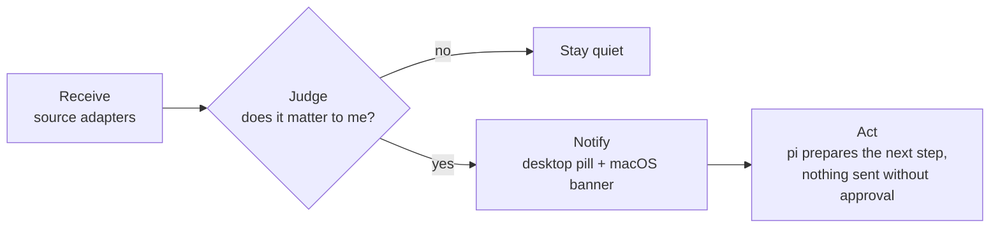

# Proactive

Pix can watch your channels and come back to you when something matters, instead of waiting to be asked.



## Parts

| Part | File | Role |
|---|---|---|
| Core | `src/proactive.ts` | Types, judge prompt, verdict parsing, inbox, rate limit |
| Sources | `src/proactive-sources.ts` | One adapter per channel (`feishu`, `command`) |
| Daemon | `scripts/proactive-daemon.ts` | Polls sources, runs the judge, writes the inbox, `act`/`dismiss` verbs |
| Pill | `scripts/proactive-pill.swift` | Always-on floating capsule; click to see alerts, Act or Dismiss |
| In pi | `extensions/proactive.ts` | Footer count and `/proactive` |

## Memory

Everything lives in `~/.pix/proactive/` (override with `PIX_PROACTIVE_DIR`), separate from other agent config:

| File | Content |
|---|---|
| `config.json` | Who you are, sources, poll interval, judge model, max alerts per hour |
| `memory.md` | What you care about, open promises, project state. The judge reads it every time; edit it freely |
| `inbox.jsonl` | Alerts, append-only; later status lines win |
| `state.json` | Per-source cursor |
| `daemon.log` | One line per judged batch |

## Add a source

Write an adapter with `fetch(src) -> Msg[]` (oldest first) and `howToRead(src, refs)`, register it in `adapters`, and add an entry to `config.json`. For a quick integration, use the generic `command` kind: any command that prints `[{"id","time","sender","text"}]`.

```json
{ "kind": "command", "id": "mail", "name": "Mail", "command": "my-mail-export --json" }
```

## Run

```bash
node scripts/proactive-daemon.ts --once --dry-run   # judge once, change nothing
swiftc -O scripts/proactive-pill.swift -o ~/.pix/proactive/pill
```

Keep both running with launchd (see brook's hub `launchd/dev.brook.pix-*.plist`). The first poll of a new source only sets the cursor, so old history does not flood you.
