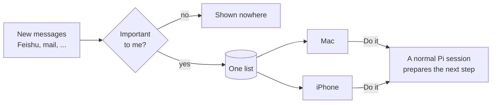
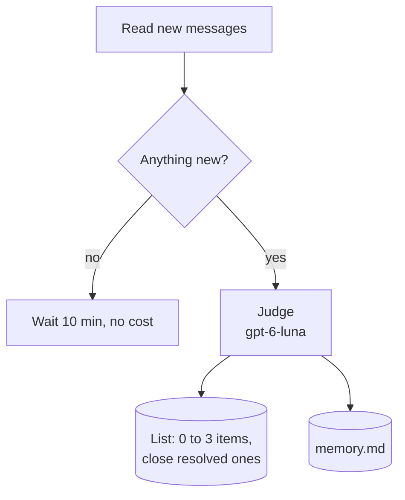
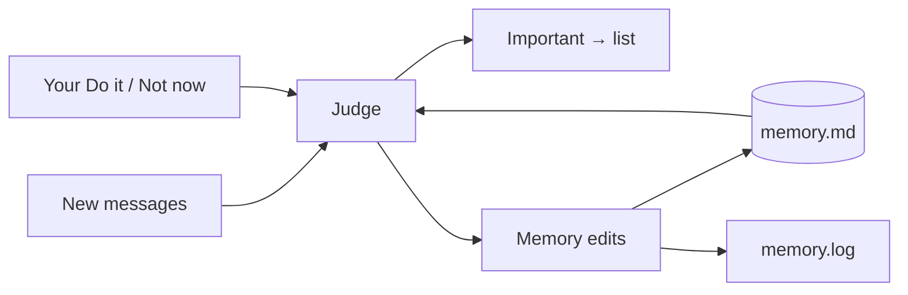
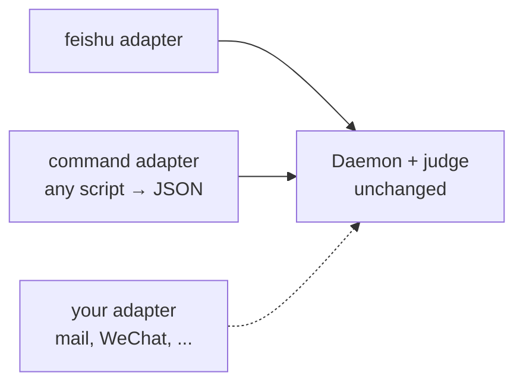

# Proactive

Most assistants wait for you to ask. Pix Proactive watches your channels, decides what matters, and comes back to you with one clear next step.

## The idea in one picture



Three rules keep it calm:

1. **Decide once.** The judge decides whether something matters. Unimportant things never appear anywhere.
2. **One list, shown everywhere.** The Mac and the iPhone show the same list. Handle an item on one, it is gone on the other.
3. **Nothing is sent without you.** "Do it" starts a Pi session that prepares the work. Anything outbound is drafted for your approval first.

## What runs where

No terminal becomes a "proactive terminal". Everything runs in the background or in normal sessions.


| Piece | File | Job |
|---|---|---|
| Core | `src/proactive.ts` | Types, judge prompt, verdict, list format, rate limit |
| Sources | `src/proactive-sources.ts` | One adapter per channel |
| Daemon | `scripts/proactive-daemon.ts` | Poll sources, judge, write the list; `act` and `dismiss` verbs |
| Mac view | `scripts/proactive-pill.swift` | Floating 🔔 with the count; click to see items |
| List + Do it | `src/proactive-store.ts` | The only code that reads or changes the list; "Do it" starts a Pi session with remote on |
| iPhone view | Pix Remote "For you" page (opened from the menu, or by tapping the push) | Same list, same buttons, a push for each new item |

## One item

Every item answers three questions and offers two buttons:

| Field | Example |
|---|---|
| What happened | The data-source doc you asked for is ready |
| Why it matters | You were waiting on it; it unblocks step 1 |
| Where | Project chat |
| **Do it** | Start a Pi session that prepares the next step |
| **Not now** | Remove it everywhere |

## The daemon

A launchd service with no window. Every 10 minutes, for each source:



One model, one call per batch of new messages (`model` in config, default `openai-codex/gpt-6-luna`). It is a tool-less `pi -p` call, so any provider Pi is logged into works. It writes items, closes pending items the chat resolved, and edits memory.

Over `maxPerHour`, new items still enter the list, marked quiet: no push, never dropped.

## Do it

All "Do it" taps go to **one** Pi session, `For you` (session id `pix-foryou`, model `gpt-6-luna`):

- If it is open, the task is queued into it, like a message from the phone.
- If not, it opens as a **new tab in the open Otty window** (tmux if Otty is not running; never a second Otty app), resuming the same session.

The item records the session, so "Pi is on it" links to exactly that session.

## Who keeps the memory

The judge does, in the same call. Besides "notify or not", it returns small edits to `memory.md`:

- **from the chat**: a promise you made, something you now wait for, a decision. Resolved lines are removed.
- **from your taps**: it sees which recent items you acted on or dismissed, and notes what you do not care about.



Edits apply on their own and are logged in `memory.log` (`+` added, `-` removed). New lines go under `## Learned`. Memory stays a plain file: read or fix it on the Mac, or from the phone's Memory view.

## Sources are plug-ins



An adapter has two functions: `fetch(source)` returns recent messages oldest first, and `howToRead(source, ids)` tells the acting session how to open the originals. Register it in `adapters` and add the source to `config.json`.

For a quick integration, use the `command` kind: any command that prints `[{"id","time","sender","text"}]`.

```json
{ "kind": "command", "id": "mail", "name": "Mail", "command": "my-mail-export --json" }
```

## Files

| File in `~/.pix/proactive/` | Content |
|---|---|
| `config.json` | Your name, sources, poll interval, `model`, pushes per hour |
| `memory.md` | What matters to you. The judge reads it every time; edit freely |
| `inbox.jsonl` | The list. Append-only; later status lines win |
| `state.json` | Last seen message per source |
| `daemon.log` | One line per judged batch |
| `memory.log` | Every automatic memory change |

Set `PIX_PROACTIVE_DIR` to use another folder.

## Run

```bash
node scripts/proactive-daemon.ts --once --dry-run   # judge once, change nothing
node scripts/proactive-daemon.ts                    # keep watching
swiftc -O scripts/proactive-pill.swift -o ~/.pix/proactive/pill
```

Keep the daemon and the pill running with launchd. The first poll of a new source only remembers where it is, so old history does not flood you.
